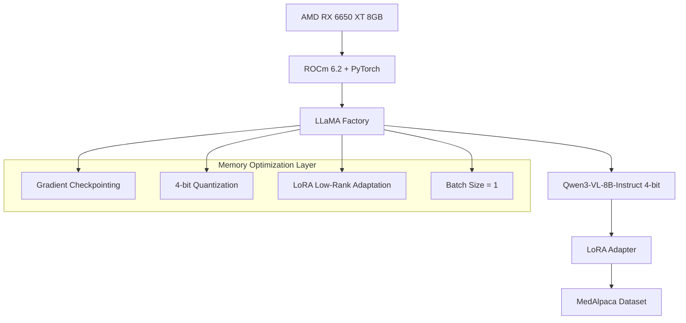

# Architettura Tecnica: Fine-tuning Qwen3-VL-8B-Instruct su AMD RX 6650 XT

## 1. Architettura del Sistema

### 1.1 Panoramica Hardware/Software

Il sistema è progettato per operare su GPU AMD RX 6650 XT con 8GB GDDR6, utilizzando ROCm 6.2 con workaround per l'architettura gfx1032 non ufficialmente supportata. L'architettura implementa un pipeline di fine-tuning memory-efficient che utilizza tecniche avanzate di quantizzazione e ottimizzazione.



### 1.2 Flusso Dati


## 2. Configurazione Hardware Specifica

### 2.1 AMD RX 6650 XT Specifications
- **Architettura**: RDNA 2 (gfx1032 - Navi 23)
- **VRAM**: 8GB GDDR6
- **Memory Bus**: 128-bit
- **Bandwidth**: 280 GB/s
- **TDP**: 180W
- **Stream Processors**: 2048

### 2.2 ROCm Workaround Configuration
```bash
# Variabili ambiente essenziali per gfx1032
export HSA_OVERRIDE_GFX_VERSION=10.3.0
export ROCM_PATH=/opt/rocm
export HIP_VISIBLE_DEVICES=0
export PYTORCH_HIP_ALLOC_CONF=garbage_collection_threshold:0.8,max_split_size_mb:512
```

### 2.3 Limitazioni Memoria e Strategie
- **VRAM Totale**: 8192MB
- **Memoria disponibile per training**: ~6.5GB (riservando 1.5GB per sistema)
- **Strategie di ottimizzazione**:
  - Quantizzazione 4-bit (riduzione 75% memoria)
  - Gradient checkpointing (50% riduzione attivazioni)
  - LoRA rank=8-16 (parametri trainabili <1%)
  - Batch size=1 con accumulation=8

## 3. Stack Tecnologico

### 3.1 Core Dependencies
```yaml
# requirements.txt
rocm-libs==6.2.0
pytorch-rocm==2.1.0
transformers>=4.40.0
bitsandbytes-rocm>=0.41.0
peft>=0.10.0
datasets>=2.14.0
llama-factory>=0.8.0
accelerate>=0.27.0
deepspeed>=0.12.0
```

### 3.2 ROCm Installation Script
```bash
#!/bin/bash
# install_rocm.sh
wget -q -O - https://repo.radeon.com/rocm/rocm.gpg.key | sudo apt-key add -
echo 'deb [arch=amd64] https://repo.radeon.com/rocm/apt/6.2 ubuntu main' | sudo tee /etc/apt/sources.list.d/rocm.list
sudo apt update
sudo apt install rocm-dev hipblas miopen-hip hipfft rocrand hipsparse
```

## 4. Strategie di Ottimizzazione Memoria

### 4.1 Quantizzazione 4-bit Implementation
```python
# Configurazione BitsAndBytes per ROCm
bnb_config = BitsAndBytesConfig(
    load_in_4bit=True,
    bnb_4bit_compute_dtype=torch.float16,
    bnb_4bit_use_double_quant=True,
    bnb_4bit_quant_type="nf4"
)
```

### 4.2 LoRA Configuration
```python
lora_config = LoraConfig(
    r=16,  # Low rank per ottimizzazione memoria
    lora_alpha=32,
    target_modules=["q_proj", "v_proj", "k_proj", "o_proj", "gate_proj", "up_proj", "down_proj"],
    lora_dropout=0.1,
    bias="none",
    task_type="CAUSAL_LM"
)
```

### 4.3 Memory Monitoring
```python
class MemoryMonitor:
    def __init__(self):
        self.initial_memory = self.get_gpu_memory()
    
    def get_gpu_memory(self):
        return torch.cuda.memory_allocated() / 1024**3  # GB
    
    def log_memory_usage(self, stage: str):
        current = self.get_gpu_memory()
        logging.info(f"[{stage}] GPU Memory: {current:.2f}GB / 8.0GB ({current/8*100:.1f}%)")
```

## 5. Pipeline di Training

### 5.1 Preprocessing MedAlpaca
```python
def preprocess_medalpaca(dataset_path: str) -> List[Dict]:
    """
    Converte MedAlpaca in formato alpaca standard
    """
    dataset = load_dataset("medalpaca/medical_meadow_medqa")
    
    formatted_data = []
    for item in dataset['train']:
        formatted_item = {
            "instruction": item['question'],
            "input": "",
            "output": item['answer']
        }
        formatted_data.append(formatted_item)
    
    return formatted_data
```

### 5.2 Training Loop con Error Handling
```python
def train_with_oom_recovery(model, train_dataloader, optimizer, num_epochs):
    """
    Training loop con gestione automatica OOM errors
    """
    for epoch in range(num_epochs):
        try:
            train_epoch(model, train_dataloader, optimizer)
        except RuntimeError as e:
            if "out of memory" in str(e):
                torch.cuda.empty_cache()
                # Riduci batch size o aumenta gradient accumulation
                adjust_training_params()
                continue
            else:
                raise e
```

## 6. Componenti del Sistema

### 6.1 Script di Setup Ambiente (`setup_environment.py`)
```python
import subprocess
import os
import logging
from typing import Dict, List

class EnvironmentSetup:
    def __init__(self):
        self.rocm_version = "6.2"
        self.required_packages = [
            "torch", "transformers", "bitsandbytes", 
            "peft", "datasets", "accelerate", "llama-factory"
        ]
    
    def verify_rocm_installation(self) -> bool:
        """Verifica che ROCm sia installato e funzionante"""
        try:
            result = subprocess.run(['rocminfo'], capture_output=True, text=True)
            return result.returncode == 0
        except FileNotFoundError:
            return False
    
    def setup_gpu_workaround(self):
        """Configura workaround per RX 6650 XT"""
        os.environ['HSA_OVERRIDE_GFX_VERSION'] = '10.3.0'
        os.environ['ROCM_PATH'] = '/opt/rocm'
        logging.info("Configurato workaround ROCm per RX 6650 XT")
```

### 6.2 Dataset Configuration (`configure_dataset.py`)
```python
def create_dataset_info():
    """
    Crea configurazione dataset per LLaMA Factory
    """
    dataset_info = {
        "medalpaca": {
            "file_name": "medalpaca.json",
            "columns": {
                "prompt": "instruction",
                "query": "input",
                "response": "output"
            }
        }
    }
    
    with open("data/dataset_info.json", "w") as f:
        json.dump(dataset_info, f, indent=2)
```

## 7. Configurazioni YAML

### 7.1 Training Configuration (`training_config.yaml`)
```yaml
model_name_or_path: Qwen/Qwen3-VL-8B-Instruct
model_revision: main

# Quantizzazione e ottimizzazione memoria
quantization_bit: 4
quantization_type: nf4
double_quantization: true
gpu_memory_fraction: 0.85

# LoRA configuration
lora_rank: 16
lora_alpha: 32
lora_dropout: 0.1
lora_target: ["q_proj", "v_proj", "k_proj", "o_proj", "gate_proj", "up_proj", "down_proj"]

# Training parameters
per_device_train_batch_size: 1
gradient_accumulation_steps: 8
learning_rate: 3.0e-5
num_train_epochs: 2
max_grad_norm: 1.0
lr_scheduler_type: cosine
warmup_ratio: 0.1

# Memory optimization
gpu_memory_limit: 6.5GB
gradient_checkpointing: true
use_unsloth: true
enable_liger_kernel: true

# Logging and checkpointing
logging_steps: 10
save_steps: 100
save_total_limit: 3
output_dir: ./medical_qwen3_output
```

## 8. Best Practices e Troubleshooting

### 8.1 Problemi Comuni ROCm su GPU non Ufficiali

**Problema**: `hipErrorNoBinaryForGpu`
**Soluzione**: 
```bash
export HSA_OVERRIDE_GFX_VERSION=10.3.0
export AMDGPU_TARGETS=gfx1032
```

**Problema**: Memory access violations
**Soluzione**:
```bash
export HSA_DISABLE_CACHE=1
export PYTORCH_HIP_ALLOC_CONF=expandable_segments:True
```

### 8.2 OOM Error Handling
```python
def handle_oom_error(func):
    """Decorator per gestione automatica OOM"""
    def wrapper(*args, **kwargs):
        try:
            return func(*args, **kwargs)
        except RuntimeError as e:
            if "out of memory" in str(e):
                torch.cuda.empty_cache()
                gc.collect()
                # Implementa strategia di recovery
                return retry_with_reduced_batch_size(func, *args, **kwargs)
            raise e
    return wrapper
```

### 8.3 Performance Tuning
- **Monitoraggio temperatura**: RX 6650 XT opera ottimamente <85°C
- **Power limit**: Considera undervolting per stabilità
- **Memory clock**: Riduci se si verificano errori memoria
- **Validation frequenti**: Salva checkpoint ogni 100 steps

### 8.4 Sicurezza e Validation
```python
def validate_model_output(model, test_questions: List[str]) -> Dict:
    """
    Valida output del modello medico
    """
    results = {}
    for question in test_questions:
        response = generate_response(model, question)
        results[question] = {
            "response": response,
            "length": len(response),
            "medical_keywords": extract_medical_terms(response),
            "safety_score": check_medical_safety(response)
        }
    return results
```

## 9. Benchmarking e Testing

### 9.1 Metriche di Performance
- **Training time per epoch**: Target <2 ore
- **Memory usage**: <6.5GB durante training
- **Inference speed**: >10 tokens/sec
- **Model quality**: BLEU score >0.7 su test set

### 9.2 Stress Testing
```python
def stress_test_memory(model, duration_minutes=30):
    """
    Test di stress per verificare stabilità memoria
    """
    start_time = time.time()
    while (time.time() - start_time) < duration_minutes * 60:
        # Esegui inference batch
        batch = generate_test_batch()
        with torch.cuda.amp.autocast():
            outputs = model(batch)
        
        # Monitora memoria
        if torch.cuda.memory_allocated() > 6.5 * 1024**3:
            raise MemoryError("Memory usage exceeded limit")
        
        torch.cuda.empty_cache()
```

## 10. Deployment Considerazioni

### 10.1 Model Export Formats
- **Merged Model**: Modello completo con LoRA integrato
- **Adapter Only**: Solo pesi LoRA (più piccolo)
- **ONNX Format**: Per deployment ottimizzato

### 10.2 Hugging Face Hub Upload
```python
def upload_to_hub(model_path: str, repo_name: str):
    """
    Carica modello fine-tunato su Hugging Face
    """
    api = HfApi()
    api.upload_folder(
        folder_path=model_path,
        repo_id=repo_name,
        repo_type="model"
    )
```

Questa architettura fornisce una base solida per l'implementazione del sistema di fine-tuning, con particolare attenzione alle ottimizzazioni per hardware AMD non ufficialmente supportato e gestione efficiente della memoria limitata.